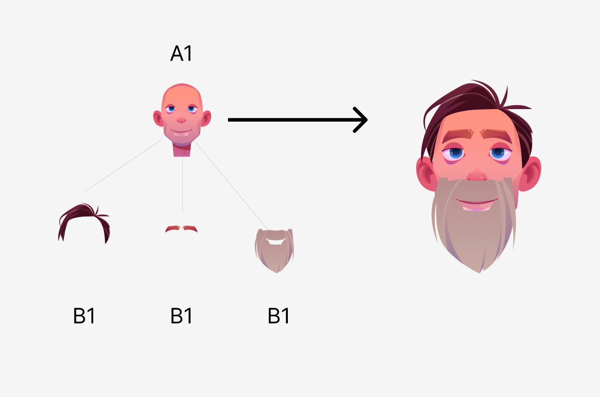

# Sample project for nesting

The project allows creating two collections for nesting demo. Then, it mints several tokens in these collections.
The main token will be in the first collection, all tokens that we are going to nest will be in the second collection.

When the tokens are minted, we carry out nesting. We will nest all tokens from the second collection into the token in 
the first collection (see example below).   

 

When the tokens are nested, we will get their images and merge them into one image of the result token. The result is saved into
the 'output.png' file. 

The config is stored in the 'config.json5' file. To work with it, we use the [JSON5](https://json5.org/) library. 

The project executes all described actions in one single launch. To run the project, please use the commands below: 

```bash:no-line-numbers
npm install
npx tsx index.mts
yarn 
yarn tsx index.mts
```
